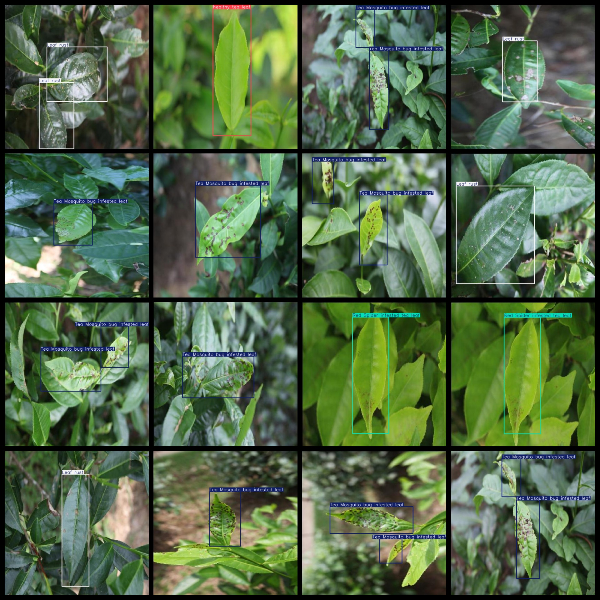
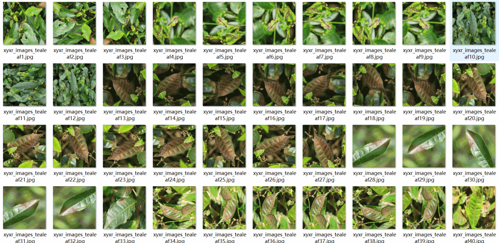

# [Object Detection] Tea Disease Dataset 5408 images7-classLabels YOLO+VOC（(Augmented) ）

Dataset Format: VOC format + YOLO format

The compressed file contains: three folders, each storing images, xml files, and text files.

Total jpg images in JPEGImages folder: 5408

The total number of xml files in the Annotations folder is 5408.

The total number of TXT files in the labels folder: 5408.

Total number of tag types: 7

Tag names: ["Black rot","Brown blight","Leaf rust","Red Spider infested tea leaf","Tea Mosquito bug infested leaf","White spot","healthy tea leaf"]

The number of boxes for each label (Note that the order of labels in the Yolo format does not correspond to this, but is based on the classes.txt file in the labels folder):

Black rot frame count = 77

Brown blight frame count = 3

Leaf rust frame count = 1871

Red Spider infested tea leaf frame count = 669

Tea Mosquito bug infested leaf frame count = 4184

White spot frame count = 193

healthy tea leaf frame count = 276

Total boxes: 7273

Picture clarity (Resolution: Pixels): Clear

Image Enhancement: Yes

Shape of the label: Rectangular box, used for object detection and recognition.

Important Note: None

Special Notice: This dataset does not guarantee the accuracy or precision of the trained models or weight files. The dataset only provides accurate and reasonable annotations.

## Images

---

Here is a pay link on Stripe (https://buy.stripe.com/3cs8yP7sY87d0vu9AB). Please contact me lonlonago@foxmail.com after funding $89, and I will send you a complete data files, thank you!

